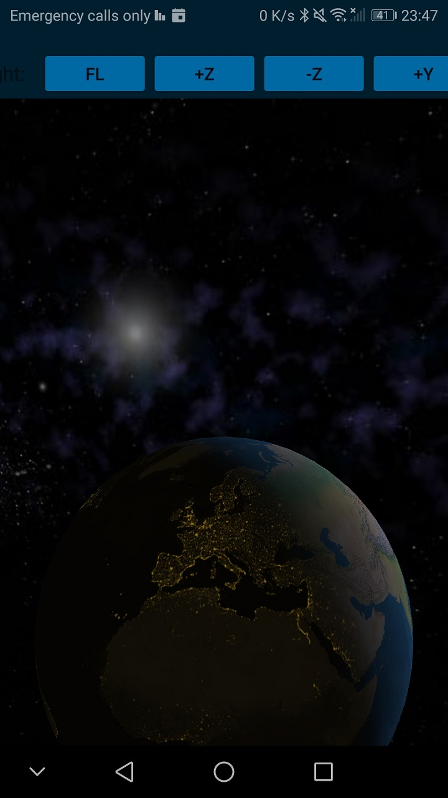
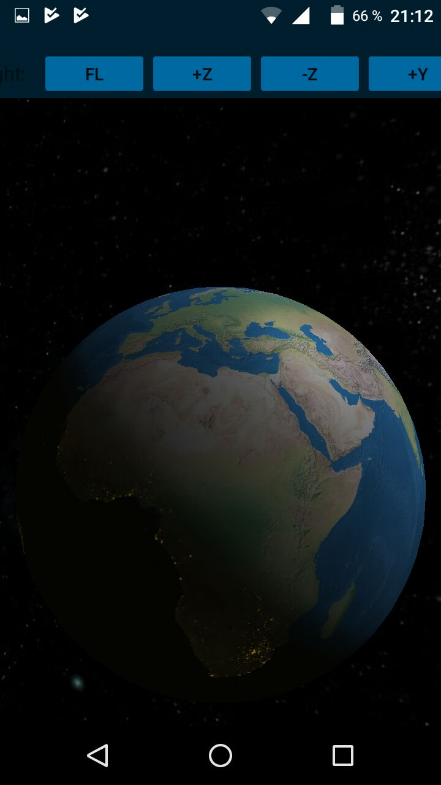

This is part of an archived project from me where I created an interactive 3D globe with Open GL ES.
A book that really helped me out during this project was: "3D Engine Design for Virtual Globes" (ISBN: 978-1568817118).

Here are some screenshots:

--

